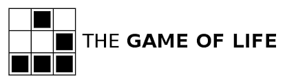

# Four Rules of Simple Design

1. Tests Pass.
2. Express Intent.
3. DRY Knowledge (Don’t Repeat Yourself).
4. Minimal.

# Conway’s Game of Life

The Game of Life, also known simply as Life, is a cellular automaton devised by the British mathematician John Horton Conway in 1970.

The "game" is a zero-player game, meaning that its evolution is determined by its initial state, requiring no further input.

One interacts with the Game of Life by creating an initial configuration and observing how it evolves. 

The universe of the Game of Life is an infinite two-dimensional orthogonal grid of square cells, each of which is in one of two possible states, live or dead. 

Every cell interacts with its eight neighbors, which are the cells that are directly horizontally, vertically, or diagonally adjacent.

At each step in time, the following transitions occur:

- Any live cell with _fewer than two_ live neighbors dies, as if caused by **underpopulation**.
- Any live cell with _more than three_ live neighbors dies, as if by **overpopulation**.
- Any live cell with _two or three_ live neighbors **stays alive** in the next generation.
- Any dead cell with _exactly three_ live neighbors **comes to life** in the next generation.

The initial pattern constitutes the seed of the system. The first generation is created by applying the above rules simultaneously to every cell in the grid. 

Births and deaths happen simultaneously, and the discrete moment at which this happens is sometimes called a tick (in other words, each generation is a pure function of the one before). 

The rules continue to be applied repeatedly to create further generations.
Write code to implement Conway’s Game of Life, keeping in mind the four rules of simple design.

